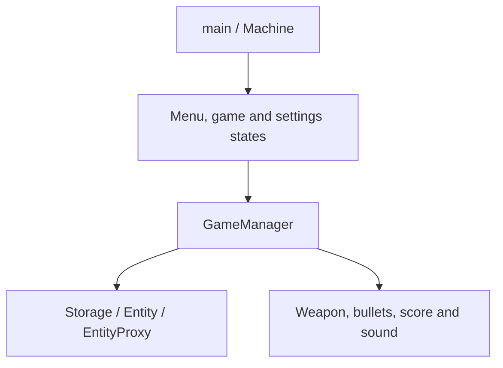

# Source walkthrough and cleanup

`main.cpp` drives `Machine`, which manages menu, new-game, level and settings states. `GameManager` handles events, active words, targets, projectiles and rendering. `Storage` loads the word dictionary. `Entity`/`EntityProxy` represent words and their visual behavior. `weapon`, `bullet`, `scoreboard` and `SoundManager` handle the player, projectiles, score and audio.

The source extracted from the nested `source.zip` is canonical. The cleanup adds a root CMake entry point, explicit SFML discovery and two filename-case corrections (`State.h`, `Roboto-Black.ttf`) for case-sensitive filesystems. The complete original submission, including unchanged source and older generated files, remains in the checksum-verified archive.

Assets are restored to the original directory layout. `Levels.cpp` references `source/image/image2.jpg`, which is absent from both supplied ZIP layers. Restoration does not fabricate this missing asset. The historical code also relies heavily on raw pointers and relative resource paths; no broad memory-management rewrite was performed.

Validation covered archive reconstruction, local include-path spelling, CMake source-file paths and documentation links. CMake and SFML were unavailable, so this is not evidence of a successful build or runtime test.
